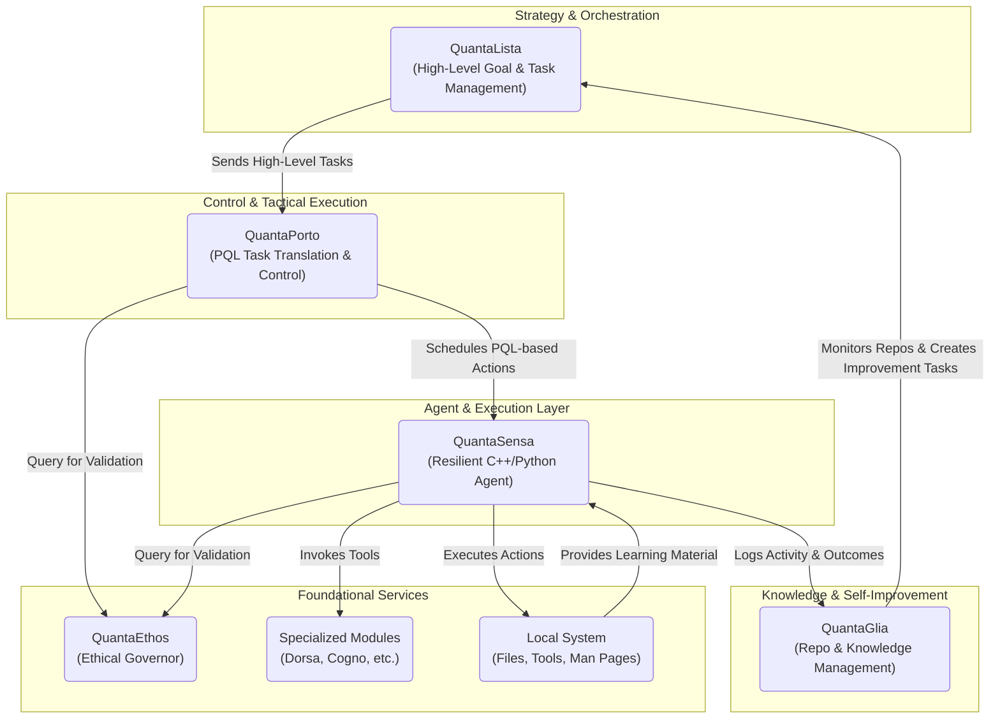

# QuantaSensa Implementation Plan

## 1. Overview

This document outlines a detailed implementation plan for the QuantaSensa framework. The plan is based on the architecture described in the `README.md` and the existing source code. The goal is to create a robust, resilient, and secure autonomous agent framework.

## 2. Core Components

### 2.1. C++ Parent Controller (`main.cpp`)

The parent controller is the entry point of the application. It is responsible for scheduling, launching, and monitoring the Python agent.

- **[ ] Configuration:**
    -   [ ] Implement a configuration loader (e.g., from a `.ini` or `.yaml` file) to manage settings like:
        -   Agent script path
        -   Allowed time window
        -   Post-action wait time
        -   Log file path and level
- **[ ] Scheduling:**
    -   [ ] Refine the `is_in_time_window()` function to be more flexible (e.g., support multiple time windows, weekdays/weekends).
- **[ ] Agent Launching:**
    -   [ ] Enhance the `launch_agent()` function to:
        -   Pass command-line arguments to the agent (e.g., for different modes of operation).
        -   Capture and log `stdout` and `stderr` from the agent process.
- **[ ] Resource Monitoring:**
    -   [ ] Implement functions to monitor system resources (CPU, memory, disk space).
    -   [ ] The controller should log these metrics and potentially adjust the agent's behavior based on resource availability.
- **[ ] State Management:**
    -   [ ] Implement a mechanism to save and restore the application's state (e.g., last run time, agent status). This is crucial for crash recovery.
- **[ ] Error Handling:**
    -   [ ] Improve error handling to cover more edge cases (e.g., agent script not found, permission errors).

### 2.2. Python Agent (`agent.py`)

The Python agent performs the actual tasks. It is designed to be a single-action process, meaning it does one thing and then exits.

- **[ ] Action Dispatcher:**
    -   [ ] Create a central dispatcher that reads a command (e.g., from `stdin` or command-line arguments) and executes the corresponding action.
- **[ ] Action Library:**
    -   [ ] Develop a library of actions that the agent can perform. These actions should be modular and easy to extend. Examples include:
        -   `file_operation`: create, delete, modify files.
        -   `shell_command`: execute a shell command.
        -   `self_update`: update the agent's own code.
- **[ ] LLM Integration:**
    -   [ ] Integrate with a local LLM to enable natural language understanding. The agent should be able to parse a command like "create a note about my new idea" and translate it into a specific action.
- **[ ] Learning Module:**
    -   [ ] Implement a module that allows the agent to learn from local resources, such as `man` pages. This could involve parsing `man` pages to understand how to use new commands.
- **[ ] Security:**
    -   [ ] Implement security measures to prevent the agent from performing dangerous actions. This could include a "sandbox" mode that restricts which commands can be executed.

### 2.3. Logging (`logger.cpp` and `logger.py`)

Logging is critical for monitoring and debugging the application.

- **[ ] C++ Logger:**
    -   [ ] Add log rotation to prevent log files from growing indefinitely.
    -   [ ] Improve performance by using a more efficient logging library or by implementing asynchronous logging.
- **[ ] Python Logger:**
    -   [ ] Unify the Python logger with the C++ logger. The agent should log to the same file as the parent controller, or to a separate file that is also monitored by the controller.
    -   [ ] The duplicate `logger.py` file should be removed and its functionality merged into `agent.py`.

## 3. Development Workflow

1.  **Phase 1: Core Functionality (M1)**
    -   Implement the basic C++ parent controller and Python agent.
    -   Establish the communication channel between the two components.
    -   Implement basic logging.
2.  **Phase 2: Action Library and LLM (M2)**
    -   Develop the action library for the Python agent.
    -   Integrate the LLM for natural language understanding.
3.  **Phase 3: Learning and Self-Improvement (M3)**
    -   Implement the learning module.
    -   Develop the agent's ability to self-update.
4.  **Phase 4: Hardening and Optimization (M4)**
    -   Improve security and error handling.
    -   Optimize performance.
    -   Add comprehensive tests.

## 4. Testing Strategy

-   **[ ] Unit Tests:** Each module should have its own set of unit tests.
-   **[ ] Integration Tests:** Test the interaction between the parent controller and the agent.
-   **[ ] End-to-End Tests:** Test the entire application in a simulated environment.
-   **[ ] Performance Tests:** Measure resource usage and execution time.

This plan provides a roadmap for developing the QuantaSensa framework. By following this plan, we can create a powerful and reliable autonomous agent.

---
---

# PrismQuanta Integration Plan

## 1. Vision and Guiding Principles

The goal of this plan is to unify the discrete PrismQuanta modules into a single
, cohesive, and autonomous system. The integration will adhere to the project's
core philosophies:

-   **Local-First & Offline:** The integrated system must operate without extern
al network dependencies, relying on local resources like `llama.cpp`.
-   **Modularity & Loose Coupling:** Components must be independently testable a
nd replaceable. Communication should occur over well-defined, simple interfaces.
-   **Minimalism & Resilience:** Prefer simple, robust technologies (e.g., shell
 scripts, file-based queues, standard CLI tools) over complex frameworks to ensu
re stability in constrained environments.
-   **Ethical Governance:** `QuantaEthos` must be a foundational, non-bypassable
 layer for all significant actions undertaken by the system.

## 2. Proposed High-Level Architecture

The system will be organized into layers of responsibility, from high-level stra
tegy to low-level execution.



### Component Roles:

-   **QuantaLista (Strategist):** Manages the master project plan. It breaks dow
n high-level goals into a queue of tasks with dependencies and priorities. It is
 the main entry point for human oversight.
-   **QuantaPorto (Commander):** The tactical controller. It consumes tasks from
 `QuantaLista`, translates them into the structured **PQL (QuantaPorto Language)
**, and schedules them for execution by the agent.
-   **QuantaSensa (Field Agent):** The hands of the system. Its C++ parent contr
oller is responsible for picking up a single scheduled task from `QuantaPorto` a
nd invoking its Python agent to execute it resiliently.
-   **QuantaGlia (Librarian):** The knowledge manager. It periodically analyzes
the entire ecosystem's repositories and activity logs to prune, archive, or spaw
n new tools and documentation, feeding its findings back into `QuantaLista` as n
ew tasks.
-   **QuantaEthos (Conscience):** A mandatory validation service. Before executi
ng any potentially impactful command, `QuantaSensa` and `QuantaPorto` must query
 `QuantaEthos` to get a go/no-go decision and a trust score.

## 3. Communication and Data Flow Strategy

To maintain simplicity and resilience, a file-based communication protocol is re
commended for the core workflow.

-   **Asynchronous Tasking (File-based Queue):**
    1.  `QuantaLista` writes a new task as a unique JSON file (e.g., `task-123.j
son`) into a shared `/queue/pending` directory.
    2.  `QuantaPorto` monitors this directory. It picks up a task, moves it to `
/queue/in_progress`, and generates a corresponding PQL file and shell command fo
r `QuantaSensa`.
    3.  `QuantaSensa`'s parent controller executes the command. Upon completion,
 it writes a result file (e.g., `result-123.json`) to `/queue/completed` and del
etes the task from `/queue/in_progress`.
    4.  `QuantaLista` monitors the `/queue/completed` and `/queue/failed` direct
ories to update its master plan.

    **Example `task-123.json`:**
    ```json
    {
      "task_id": "task-123",
      "description": "Refactor the logging module in QuantaSensa.",
      "priority": "high",
      "dependencies": ["task-115"],
      "component": "QuantaSensa",
      "max_runtime_sec": 300
    }
    ```

-   **Synchronous Validation (CLI Service):**
    -   `QuantaEthos` will be packaged as a standalone executable. Other compone
nts will call it via a shell command, passing the proposed action as an argument
. `QuantaEthos` will print a JSON object with the validation result to `stdout`,
 which the calling component will parse.
    -   **Example Call:** `quanta-ethos "rm -rf /critical/data"`
    -   **Example `stdout` Response:**
        ```json
        {
          "decision": "deny",
          "reason": "High-risk command pattern 'rm -rf' detected on a protected
path.",
          "trust_score": 0.1
        }
        ```

-   **Centralized Logging:**
    -   Each component will maintain its own detailed log file (e.g., `sensa_age
nt.log`).
    -   For key events, each component will also append a single, structured lin
e to a central `events.jsonl` file. This provides a unified stream for monitorin
g tools like `QuantaPulsa` and `QuantaAlarma`.

## 4. Phased Integration Roadmap

### Phase 1: The Core Execution Loop (Sensa + Ethos + Porto)
1.  **Standardize Configuration:** Create a root `prismquanta.env` file to defin
e all shared paths (queues, logs, repo locations). All scripts must source this
file.
2.  **Package `QuantaEthos`:** Build `QuantaEthos` as a command-line tool that a
ccepts a string and returns a JSON validation object.
3.  **Integrate `QuantaSensa` and `QuantaPorto`:**
    -   Modify `QuantaPorto` to generate a simple shell script for a given task.
    -   Modify `QuantaSensa`'s C++ parent controller to poll a directory for thi
s script, execute it, and log the result.
    -   The parent controller **must** call the `QuantaEthos` CLI tool for valid
ation before executing the script.

### Phase 2: High-Level Orchestration (Lista)
1.  **Implement `QuantaLista`:** Develop `QuantaLista` to manage the file-based
task queue in `/queue/pending`. It should provide CLI commands to add, list, and
 prioritize tasks.
2.  **Connect `QuantaLista` to `QuantaPorto`:** `QuantaPorto` will now be driven
 by the tasks appearing in the queue managed by `QuantaLista`, forming the compl
ete strategy-to-execution pipeline.
3.  **Implement Feedback Loop:** `QuantaLista` will monitor the `/queue/complete
d` and `/queue/failed` directories to track overall project progress.

### Phase 3: Self-Awareness and Knowledge Management (Glia)
1.  **Develop `QuantaGlia` Triggers:** `QuantaGlia` will be a scheduled process
(e.g., cron job) that scans all project repositories and the central `events.jso
nl` log.
2.  **Implement `QuantaGlia` Actions:** Based on its analysis (e.g., detecting r
epeated errors, identifying missing documentation), `QuantaGlia` will autonomous
ly create new tasks and place them in `QuantaLista`'s queue.

### Phase 4: Full Ecosystem and Visualization
1.  **Integrate Specialized Modules:** Wrap modules like `QuantaDorsa` and `Quan
taCogno` with simple CLI interfaces so they can be invoked as tools by `QuantaSe
nsa` agents.
2.  **Activate Monitoring:** Develop `QuantaPulsa` and `QuantaAlarma` as service
s that tail the `events.jsonl` file to provide real-time system health monitorin
g and alerts.
3.  **Unify Visualization Tools:**
    -   **Short-Term:** Provide documentation for running Windows-based visualiz
ers (`QuantaRetina`, `multiple_viewer`) in a container or VM.
    -   **Long-Term:** Re-implement the visualization logic using a cross-platfo
rm terminal library (e.g., `ncurses` in C++, `Textual` in Python) or as a simple
 local web application that reads data files.

## 5. Build and Deployment Strategy

-   **Unified Build System:** A top-level `Makefile` or `build_all.sh` script wi
ll orchestrate the build process for the entire ecosystem:
    -   Run `cmake` and `make` for all C++ components.
    -   Create Python virtual environments and install dependencies via `pip` fo
r all Python components.
    -   Run `R` dependency installation scripts.
-   **Unified Testing:** A `test_all.sh` script will run unit and integration te
sts for each module, using mock components where necessary to ensure isolated an
d repeatable testing.
-   **Master Control Script:** A `start_system.sh` script will launch all necess
ary components in the correct order (e.g., monitoring daemons, `QuantaLista` in
a watch loop).

## 6. Challenges and Mitigations

### Challenge 1: Concurrency and Race Conditions
**Description:** With multiple components monitoring file-based queues, there is
 a risk of two processes attempting to claim the same task file simultaneously,
leading to duplicated or lost work.
**Mitigation:**
-   **Atomic Operations:** Use atomic file system operations like `mv`. On POSIX
-compliant systems, `mv` is an atomic operation within the same filesystem, ensu
ring that a file "move" is an all-or-nothing action.
-   **Locking Mechanism:** Before processing a file in `/queue/pending`, a compo
nent will attempt to create a corresponding `.lock` file (e.g., `task-123.json.l
ock`). If the lock file creation succeeds, the component has exclusive access. T
he lock file is deleted upon completion.

### Challenge 2: State Management and Crash Recovery
**Description:** If a component (e.g., `QuantaSensa`) crashes while a task is in
 the `/queue/in_progress` directory, the task will be orphaned and never complet
ed.
**Mitigation:**
-   **Task Timeouts:** Each task JSON will include a `max_runtime_sec` field.
-   **Reaper Process:** A "reaper" function within `QuantaLista` will periodical
ly scan the `/queue/in_progress` directory. If a task's file modification time e
xceeds its `max_runtime_sec`, it will be moved to a `/queue/failed` directory. A
 detailed failure log will be generated, noting the timeout.

### Challenge 3: Local LLM Performance Bottlenecks
**Description:** The synchronous validation call to `QuantaEthos` could become a
 significant bottleneck if the local LLM is slow, delaying every critical action
 across the system.
**Mitigation:**
-   **Model Tiering:** Use smaller, faster, quantized models specifically for `Q
uantaEthos`. The ethical validation task is often a classification or simple pat
tern-matching problem that doesn't require a large, powerful model.
-   **Prompt Engineering:** Design prompts for `QuantaEthos` to be extremely con
cise and require a simple, structured output (e.g., a single JSON object), minim
izing token generation time.
-   **Caching:** Implement a simple cache (e.g., an in-memory map or a file-base
d key-value store) within `QuantaEthos`. If an identical command is validated mu
ltiple times within a short period, return the cached decision.

### Challenge 4: Cross-Platform Compatibility
**Description:** The ecosystem involves C++, Python, R, and shell scripts, inten
ded to run on both Linux and Windows. Differences in file paths, shell commands
(`rm` vs `del`), and system APIs pose a significant integration challenge.
**Mitigation:**
-   **Configuration Abstraction:** Strictly enforce the use of the `prismquanta.
env` file for all paths. Scripts should source this file to get environment-spec
ific locations.
-   **Containerization (Short-Term):** For Windows-specific components like the
visualizers, the recommended deployment method will be within a container (Docke
r) or a Linux environment via WSL2. This isolates them from the host and provide
s a consistent Linux environment.
-   **Cross-Platform Tooling (Long-Term):** Prioritize re-implementing critical
UI components using cross-platform technologies (e.g., a simple web server in Py
thon with a web UI, or a terminal UI library like `Textual`).
-   **Conditional Logic in Scripts:** Where unavoidable, use conditional logic i
n shell scripts to detect the OS (`if [[ "$OSTYPE" == "linux-gnu"* ]]`) and exec
ute the appropriate command.

### Challenge 5: Integration Testing Complexity
**Description:** Testing the interaction between multiple asynchronous component
s written in different languages is inherently difficult.
**Mitigation:**
-   **Mock Components:** Develop lightweight, mock versions of key executables f
or testing purposes. For example, a `mock_quanta_ethos` script that always retur
ns an "approved" JSON, or a `mock_sensa_agent` that immediately creates a succes
s result file.
-   **Dedicated Test Suite:** Create an integration test script (`test_integrati
on.sh`) that:
    1.  Sets up a temporary queue directory structure.
    2.  Launches the components under test (e.g., `QuantaLista`, `QuantaPorto`).
    3.  Uses mock components for dependencies (like `QuantaSensa`).
    4.  Places a series of test task files into `/queue/pending`.
    5.  Asserts that the expected result files appear in `/queue/completed` or `
/queue/failed` within a timeout.
    6.  Cleans up all temporary files and processes.

## 7. Component-Specific Integration Details

### QuantaEthos (The Conscience)
-   **Interface:** Standalone CLI executable (`quanta-ethos`).
-   **Input:** A single string argument containing the command or action to be v
alidated.
-   **Output:** A single JSON object to `stdout`.
-   **Implementation:**
    -   Must be extremely lightweight. It will be called frequently and should h
ave minimal startup overhead.
    -   Will use a dedicated, highly quantized LLM optimized for classification
and safety tasks.
    -   Will contain a non-LLM-based rules engine for immediate denial of high-r
isk patterns (e.g., `rm -rf /`, `> /dev/sda`).
    -   The `trust_score` will be a float between 0.0 and 1.0, allowing consumin
g services to set their own acceptance thresholds.

### QuantaPorto (The Commander)
-   **Primary Loop:**
    1.  Scan `/queue/pending` for the highest priority task file.
    2.  Use an atomic `mv` to move the task file to `/queue/in_progress`, effect
ively locking it.
    3.  Parse the task JSON.
    4.  Invoke its internal LLM to translate the natural language `description`
into a structured PQL command or a shell script.
    5.  **Self-Validation:** Before finalizing, `QuantaPorto` can optionally cal
l `quanta-ethos` on its generated script as a pre-check.
    6.  Write the final executable script to a new file in a `/actions/pending`
directory, named with the same task ID (e.g., `task-123.sh`).
    7.  The original task file remains in `/queue/in_progress` as a record of th
e active job.

### QuantaSensa (The Field Agent)
-   **Parent Controller (C++) Loop:**
    1.  Scan `/actions/pending` for a script file.
    2.  Atomically move the script to `/actions/in_progress`.
    3.  Read the script content.
    4.  **Mandatory Validation:** Execute `quanta-ethos` with the script content
 as input. If the decision is `deny`, move the script to `/actions/failed` and c
reate a corresponding failure result in `/queue/failed`. Abort this task.
    5.  If approved, execute the script, capturing `stdout` and `stderr`.
    6.  Upon completion, create a `result-123.json` file in `/queue/completed` (
or `/queue/failed` if the script returned a non-zero exit code). The result file
 should contain the original task ID, status, and any captured output.
    7.  Delete the script from `/actions/in_progress` and the original task file
 from `/queue/in_progress`.

### QuantaLista (The Strategist)
-   **User Interface:** A simple CLI tool (`quantalista-cli`) will provide the p
rimary human interface.
    -   `quantalista-cli add --priority high "Deploy the new monitoring script."
` -> Creates a new task file in `/queue/pending`.
    -   `quantalista-cli list` -> Displays tasks in all queues.
    -   `quantalista-cli status <task_id>` -> Shows the current state and histor
y of a task.
-   **Monitoring Daemon:** A background process will continuously monitor `/queu
e/completed` and `/queue/failed` to update a central state ledger (e.g., a simpl
e SQLite database or a master JSON file) that tracks the history and outcome of
all tasks.

### QuantaGlia (The Librarian)
-   **Trigger:** Will be executed via a system scheduler (e.g., a cron job) on a
 configurable interval (e.g., once every 6 hours).
-   **Execution Flow:**
    1.  Scan all repository directories defined in `prismquanta.env`.
    2.  Analyze git history, file sizes, and modification times.
    3.  Scan the central `events.jsonl` for patterns (e.g., repeated command fai
lures).
    4.  Use its internal LLM to reason about potential improvements (e.g., "The
`test_model_config.sh` script has failed 5 times with the same error. A task sho
uld be created to investigate.").
    5.  Generate a new task JSON file and place it directly into `QuantaLista`'s
 `/queue/pending` directory. The task description will contain the justification
 for its creation.

## 8. Monitoring and Observability Strategy

The central `events.jsonl` file is the backbone of system observability. Every s
ignificant action from any component should be logged here.

### `events.jsonl` Structure
Each line is a self-contained JSON object.
```json
{
  "timestamp": "2023-10-27T10:00:05Z",
  "component": "QuantaSensa",
  "level": "INFO",
  "event_type": "action_execution_start",
  "message": "Executing script for task-123.",
  "metadata": {
    "task_id": "task-123",
    "script_path": "/path/to/actions/in_progress/task-123.sh"
  }
}
```

### Monitoring Tools
-   **QuantaPulsa (Real-time Dashboard):** A terminal-based tool (e.g., using Py
thon's `Textual` or `curses`) that tails `events.jsonl`. It will provide a live-
updating dashboard showing:
    -   The current count of tasks in each queue (`pending`, `in_progress`, `fai
led`).
    -   A real-time stream of the latest events.
    -   A summary of recent errors.
    -   CPU/Memory usage of the host system.
-   **QuantaAlarma (Alerting Daemon):** A lightweight background service that al
so tails `events.jsonl`. It will read a configuration file (`alarms.yaml`) to tr
igger actions based on event patterns.
    -   **Example `alarms.yaml` rule:**
      ```yaml
      - name: "High-Risk Action Approved"
        condition:
          event_type: "ethos_validation_complete"
          metadata.trust_score: "< 0.5"
          metadata.decision: "approve"
        action: "send_email --to admin@local.host --subject 'Low-Trust Action Ap
proved'"
      ```

## 9. Human-in-the-Loop (HITL) and Safety Controls

The system must be designed for safe human oversight and intervention.

### System-Wide Pause
-   A "pause" file (e.g., `/run/prismquanta.pause`) will act as a global stop si
gnal.
-   Before starting any new task processing loop, every component (`QuantaPorto`
, `QuantaSensa`, etc.) **must** check for the existence of this file.
-   If the file exists, the component should log that it is paused and wait, che
cking for the file's removal every few seconds.
-   A simple `system_pause.sh` and `system_resume.sh` script will create and rem
ove this file.

### Manual Task Approval
-   A special queue directory, `/queue/human_approval`, will be created.
-   `QuantaEthos` can be configured to respond with a `defer_to_human` decision
for ambiguous or high-impact commands.
-   When a component receives this decision, it will move the corresponding task
 file to the `/queue/human_approval` directory.
-   The system will take no further action on this task until a human operator m
anually inspects the task file and moves it back to `/queue/pending` to be re-pr
ocessed.

### Interactive Review
-   A CLI tool (`quantalista-cli review`) will provide an interactive session fo
r managing the `human_approval` queue. It will allow an operator to:
    -   List all tasks pending approval.
    -   View the content of the task and the proposed action.
    -   Approve (move to `/queue/pending`), Deny (move to `/queue/failed`), or E
dit the task.

## 10. Resource Management and System Efficiency

To ensure the system remains stable and performant in constrained environments,
a strict resource management strategy is essential.

### Lightweight Process Management
-   **On-Demand Execution:** The core principle is to run processes only when ne
eded. `QuantaSensa`'s single-action-per-invocation model is the primary example.
-   **Scheduled, Not Persistent, Daemons:** Resource-intensive analysis tasks, s
uch as those performed by `QuantaGlia`, will not run as persistent daemons. Inst
ead, they will be invoked periodically by a system scheduler like `cron`, perfor
m their work, and exit.
-   **Minimalist Tooling:** Monitoring tools like `QuantaAlarma` will be simple
scripts that use efficient file-watching utilities (e.g., `tail -f` or `inotifyw
ait`) rather than heavy, continuously polling loops.

### LLM Inference Optimization
-   **Model Specialization and Tiering:** The system will not rely on a single,
monolithic LLM. Instead, it will use a tiered approach defined in `prismquanta.e
nv`:
    -   `ETHOS_MODEL_PATH`: A small, highly quantized model (e.g., 1.5B paramete
rs, 4-bit quantization) for the frequent, low-latency validation checks in `Quan
taEthos`.
    -   `PORTO_MODEL_PATH`: A mid-sized model for `QuantaPorto`'s more complex t
ask-to-script translation.
    -   `GLIA_MODEL_PATH`: A larger, more capable model for `QuantaGlia`'s infre
quent, high-level analysis and reasoning tasks.
-   **Inference Caching:** `QuantaEthos` will implement a cache for validation d
ecisions. Before invoking the LLM, it will compute a hash of the command string
and check a local cache (e.g., a SQLite database). If a recent, non-expired deci
sion exists, it will be returned immediately, dramatically reducing redundant co
mputations.

### Data Lifecycle and Pruning
-   **Log Rotation:** A scheduled "janitor" script will manage the `events.jsonl
` file. When the file exceeds a configured size (e.g., 100MB), it will be compre
ssed and timestamped (e.g., `events-2023-10-27.jsonl.gz`), and a new, empty log
file will be created.
-   **Queue Archiving:** The same janitor script will periodically archive the c
ontents of the `/queue/completed` and `/queue/failed` directories. Task results
older than a configured retention period (e.g., 14 days) will be bundled into a
compressed archive and removed from the active queue directories to prevent inde
finite disk usage growth.

## 11. Dependency and Environment Management

A consistent and reproducible environment is key to operational efficiency and s
tability.

### Centralized Configuration
-   The `prismquanta.env` file is the **single source of truth** for all system
paths, model locations, and key operational parameters (e.g., queue retention pe
riods).
-   All scripts and executables **must** source this file at startup to load the
ir configuration. Hardcoding paths is strictly forbidden.

### Reproducible Builds
-   **Python:** Each Python component will have a `requirements.txt` file. The `
build_all.sh` script will create a dedicated Python virtual environment (`venv`)
 for each component and install its specific dependencies, ensuring no cross-com
ponent dependency conflicts.
-   **C++:** All C++ components will use `cmake`. The top-level build script wil
l iterate through them, running a standard `cmake . && make` sequence and placin
g the final binaries into a central `${PRISMQUANTA_ROOT}/bin` directory.
-   **Environment Validation:** A `check_system.sh` script will be provided. It
will run before a full system start to verify that all required tools (`g++`, `p
ython3`, `Rscript`), directories, models, and dependencies are present and corre
ctly configured, preventing runtime failures due to setup issues.

## 12. Security and Sandboxing Posture

Efficient resource management is intrinsically linked to security. The system mu
st prevent any single component from consuming excessive resources or performing
 unauthorized actions.

### Principle of Least Privilege
-   **Dedicated User:** All PrismQuanta components should run under a dedicated,
 low-privilege user account (e.g., `prismquanta`).
-   **File Permissions:** The queue and log directories will have strict permiss
ions. For example, the `QuantaSensa` process will only have write access to the
`/actions` and `/queue/completed|failed` directories, but not to `/queue/pending
`.

### Execution Sandboxing for QuantaSensa
The `QuantaSensa` C++ parent controller is the primary enforcement point for san
dboxing and will apply resource limits *before* executing any action script.
-   **Resource Limits (cgroups):** On Linux, the parent controller will use `cgr
oups` to create a transient slice for each action it executes. This will enforce
 hard caps on CPU usage (e.g., `CPUQuota=50%`) and memory (e.g., `MemoryMax=512M
`), preventing a faulty script from destabilizing the host.
-   **Filesystem Isolation (Namespaces):** The parent controller can use `mount`
 namespaces to provide the action script with a restricted view of the filesyste
m. It can create a temporary, private `/tmp` directory and only bind-mount the s
pecific project directories the task needs to access.
-   **Configuration Immutability:** Critical configuration files (e.g., `prismqu
anta.env`, `alarms.yaml`) will be owned by a root/admin user, with read-only per
missions for the `prismquanta` user. This prevents an agent from modifying its o
wn operational parameters or safety rules.
